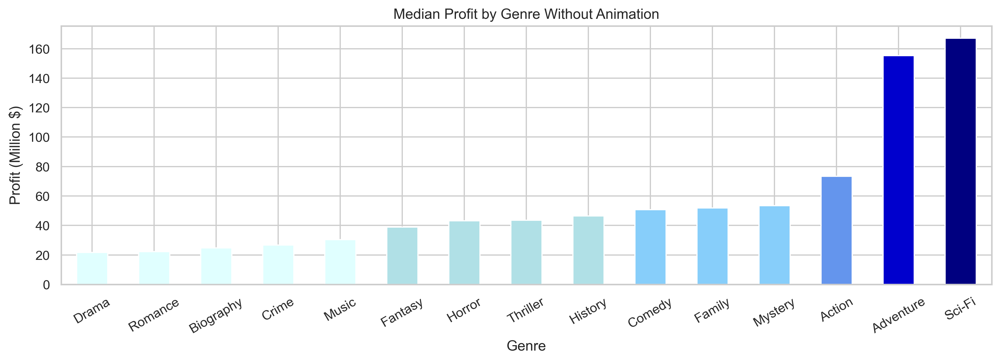
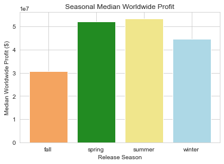
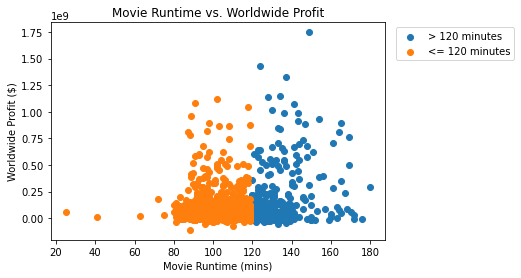

# Data Dreamers Semester 1 Capstone Project
Authored by:
- Habib Khadri
- Nick Kirbabas
- Seerat Mutneja
- Sidhya Raman
- Douglas Riggs
- Andrew Yang

## <ins>Repo Structure</ins>
This repo has our [Presentation](./pdfs/Presentation.pdf), which gives our findings in a non-technical presentation. It also has our [Notebook](./student.ipynb) which is a walkthrough of our process and our code.

## <ins>Overview</ins>
* [***Business Understanding:***](#business-understanding)
* [***Data Understanding And Analysis***](#data-understanding-and-analysis)
* [***Statistical Communication***](#statistical-communication)
* [***Conclusion***](#conclusion)
This Project is to interpret Data for our client, Computing Vision, to create the best movie possible. We'll clean and interpret data, create visualizations, and perform statistical analysis to give a few reccomendations on how to create a successful movie.

## <ins>Business Understanding</ins>

We are working for a company called Computing Vision which wants to create a new movie studio. We need to explore characteristics that movies currently performing well in the box office have. Then, we'll create analysis from our data exploration and give Computing Vision reccomendations on the best approach to creating a successful movie.

## <ins>Data Understanding and Analysis</ins>

We used data from publicly available websites storing information about movies. We used IMDB, TN, BOM, and TMDB.

The data from these databases includes movie titles, release date, ratings, production cost, gross revenue domestic and worldwide, language, movie genre, actors, actresses, directors, producers, and writers.

For our analysis, we chose gross profit (worldwide gross revenue - production budget) as the best indicator of a movie's success. It's a pretty simple metric, where more money = more success.

As far as movie characteristics go, we investigated release dates, ratings, movie genre, runtime, and cast/production crew to look for factors that were present in good movies. The best characteristics that we were able to differentiate were runtime, genre, and release date.

We found that the most successful genre was Sci-Fi

We found that movies released in warmer months (Spring and Summer) performed better than movies released in colder months (Fall and Winter)

We found that longer movies tended to create more profit than shorter movies.

## <ins>Statistical Communication</ins>

To solidify our results, we ran statistical analysis on our data for how shorter vs longer movies performed.

For the runtime length of the movie, we chose these Hypothises:
- H0: On Average, Movies longer than two hours do not make more worldwide profit than those shorter than two hours.
- Ha: On Average, Movies longer than two hours do make more worldwide profit than those shorter than two hours.

We chose two hours, since to us it felt like the difference between a 'normal' movie and a 'long' movie. We thought that longer movies could perform better, since they have a longer time to build character development and time to have a more in-depth plot, causing audiences to enjoy the movie more.

After running a T-test with the 2 samples, we got a resulting t-statistic of 8.5, with a p-value of 2.9e-17. Since the p-value was lower than our alpha level of .05, we were able to reject the null hypothesis, and found that movies with a long length did, on average, perform better than movies with a short length.

## <ins>Conclusion</ins>

Computing Vision should create a long Sci-Fi movie and release it in the summer. With this strategy, movies had a median profit of $443 million, so Computing Vision could expect to do very well at the box office.